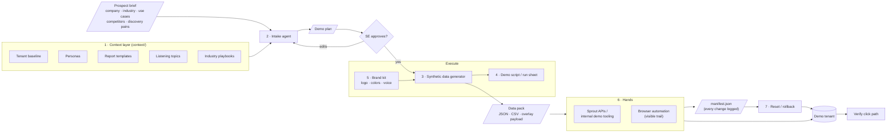
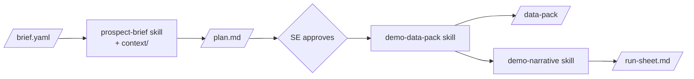

# Architecture

## Whole system (target state)

## The first slice (what we build first)

Only the left half. The handoff is files, not a tenant.

**Done when:** an SE can hand over a brief, approve a plan in under 10 minutes,
and get a data pack + run sheet they'd actually use, for each of the three
target verticals.

## Design decisions

### Why an explicit plan artifact
The plan (`schemas/demo-plan.schema.json`) is the consent boundary, like
MeshMesh's "nothing runs without your consent." It's short enough to review
quickly. It names the story, the screens, the data to generate, and anything
that will touch a tenant. Editing the plan is cheaper than regenerating a pack.

### Two routes for the "hands"
| | Sprout APIs / internal tooling | Browser automation |
| --- | --- | --- |
| Reliability | High | Medium (UI changes break selectors) |
| Coverage | Read most things. Write: draft posts + media only. **No update or delete** ([api-coverage.md](api-coverage.md)) | Anything visible on screen |
| Persistence | Real tenant data | Overlay: until reload. UI-driven seeding: persists |
| Rollback | None via API | Overlay: `revert()`. Seeded: manifest-driven delete |
| Watchability | Logs | SE can watch it happen |

Default: use the API to **read** (inventory, analytics, diagnose) and to create
reusable per-vertical drafts. Use the browser for everything else, including
any cleanup.
For anything that only needs to *look* right for one call (names, logos,
captions), prefer the overlay. It never writes to the tenant, so there's
nothing to roll back.

### Where the "live" feel comes from
Social networks restrict fake publishing and engagement, so we keep real
network activity to the minimum. Liveliness comes from:
- Seeded data in the demo tenant (scheduled posts, report history)
- Browser overlay for prospect-specific names, branding, and copy
- Real inbox messages on X, sent only from two fake customer profiles to the
  demo brand's own X profile (CLAUDE.md rule 3). These can be timed to arrive
  during the demo

### Rollback model
- **Overlay:** stateless. Reload or `__demoTailor.revert()`.
- **Seeded data:** every create gets written to `manifest.json` before it
  happens. Reset = walk the manifest backward.
- **Whole tenant:** no platform snapshot exists. A read-only inventory
  before and after each demo catches leftovers. Details and limits (X messages,
  analytics history) are in [tenant-snapshots.md](tenant-snapshots.md).

## Reuse beyond demos

| Pillar | Reuses | Adds |
| --- | --- | --- |
| **Demos** (first) | All of it | n/a |
| **Business Value / ROI** | Brief, context layer, plan + approval gate | ROI model template. Numbers must come from sourced inputs, never generated |
| **Customer risk SAs** | Context layer (what "good setup" looks like), browser hands (read-only) | "Diagnose" mode: scan an account's setup against the baseline, flag adoption gaps |
