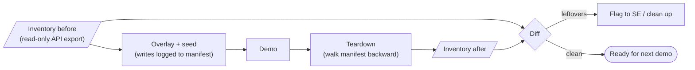

# Tenant snapshots and reset

"Snapshot" in this project means one thing: **getting the demo tenant back to
a known-good state after a demo.** There are a few ways to do that, and they
differ a lot in what they need from Sprout.

## Why reset matters
Every tailored demo adds things to the tenant: prospect-named posts,
campaigns, inbox messages, listening topics. If those aren't removed, the next
SE's demo for a different prospect shows them. That's embarrassing at best,
and a confidentiality problem at worst.

## The options

| Option | How it works | Needs | Fit for us today |
| --- | --- | --- | --- |
| **A. Platform snapshot/restore** | Sprout engineering copies the tenant's data at a point in time and restores it on demand, like a database backup | Internal platform tooling. You said none exists, and the public API isn't built for this | ❌ Not available. Only worth asking Sprout engineering about later |
| **B. Fresh tenant per demo** | Provision a new demo tenant each time, throw it away afterward | A way to create tenants and connect profiles quickly | ❌ Probably too slow and manual without tooling |
| **C. Declarative re-seed** | Write the baseline down as data (`baseline.json`). Reset = delete everything not in the baseline, recreate anything missing | API create **and** delete for each object type | ❌ The API has no delete ([api-coverage.md](api-coverage.md)) |
| **D. Manifest teardown** | Log every change *we* make in `manifest.json`, then undo exactly those changes in reverse | A way to undo each thing we create | ✅ Still the fit, but the undo runs in the browser (or by hand), since the API can't delete |
| **E. Overlay only** | Never write to the tenant. Prospect names and copy are swapped in the browser | Nothing (demo-tailor `demo-overlay`) | ✅ Zero reset. But it can't change charts or anything after a hard reload |

## Recommendation: overlay first, manifest for the rest, an inventory to catch leftovers

> **Update:** the API can't delete or update, so the plan is now
> *seed once per vertical, overlay per prospect*. Prospect names never get
> written to the tenant, which removes most of the need to reset. See
> [api-coverage.md](api-coverage.md#the-strategy-this-forces-seed-per-vertical-overlay-per-prospect).

1. **Overlay by default (E).** Anything that only has to *look* like the
   prospect for one call: names, logos, captions, campaign names. Nothing to
   reset.
2. **Seed only what the overlay can't fake (D).** For example, inbox messages
   that need to be clickable and assignable, or scheduled posts that should
   open in the composer. Each write goes to `runs/<run>/manifest.json` *before*
   it happens, with what's needed to undo it (an ID, a URL).
3. **A read-only "inventory snapshot" as the safety net.** This is the version
   of a snapshot we *can* build. Before a demo, use the API to export what's
   readable (metadata, inbox messages from the fake X profiles, cases,
   analytics). After the reset, export again and diff. Drafts have no list call, so they're checked
   one by one using the IDs in the manifest. It doesn't restore anything, but
   it shows what's left over.

## What can't be fully undone

- **Messages sent on X.** Inbox seeding uses real X activity between the two
  demo profiles. Deleting the posts or DMs on X may not remove them from
  Sprout's inbox history. Plan for them to stay: mark them complete or
  archived in Sprout, and keep their content generic enough to survive
  being seen by the next prospect, or tag them per run so they're filtered out.
- **Analytics history.** Reports come from real activity on the connected
  profiles, so they build up over time and can't be rolled back. Keep report
  screens generic, or cover them with the overlay.
- **Anything Sprout logs for auditing**, like approval history or activity
  logs. Assume it's permanent, so prospect names should never go there.
  Prefer overlaying names over writing them.

## Open items
- ~~Which object types support delete via the API?~~ None. Teardown is browser or by hand.
- Does deleting an X post or DM remove the matching Sprout inbox item?
- One demo tenant or several? If several, a simple check-out/check-in rule avoids two SEs resetting the same tenant at once.
